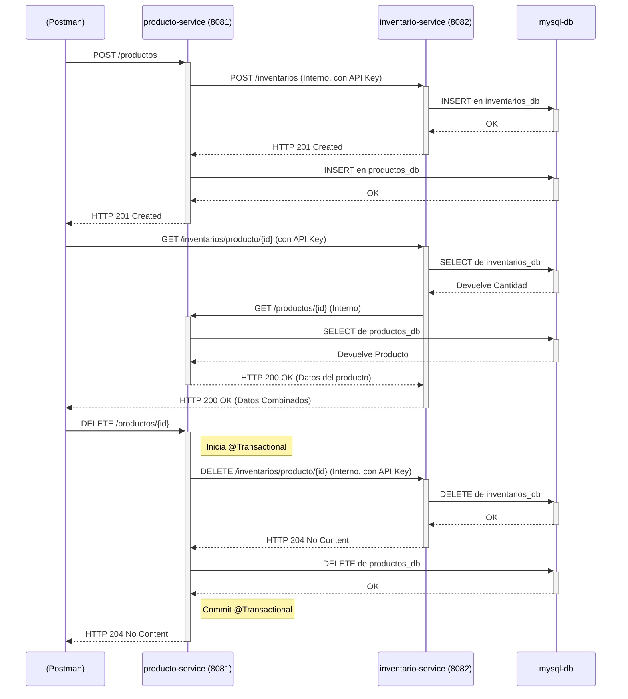

# Proyecto: Microservicios de Productos e Inventario

Esta es una solución de microservicios que simula la gestión de productos y su inventario correspondiente, cumpliendo con los requisitos de una prueba técnica.

## 1. Descripción de la Arquitectura

La solución está compuesta por dos microservicios independientes, orquestados por Docker Compose:

* **`producto-service` (Puerto 8081):**
    * Gestiona el CRUD (Crear, Leer, Actualizar, Borrar) de los productos.
    * Contiene la lógica de negocio para la creación y eliminación de productos, asegurando la consistencia transaccional llamando al servicio de inventario.

* **`inventario-service` (Puerto 8082):**
    * Gestiona las existencias de un producto.
    * Expone un endpoint para consultar el inventario combinado (Inventario + Detalles del Producto).
    * Recibe llamadas internas desde `producto-service` para crear o eliminar registros de inventario.

* **`mysql-db` (Puerto 3306):**
    * Una única instancia de MySQL 8 que aloja dos bases de datos separadas (`productos_db` e `inventarios_db`), una para cada microservicio, garantizando el aislamiento de los datos.

La comunicación entre servicios es **síncrona (HTTP/REST)**. La seguridad interna se maneja mediante un **API Key compartido** (`SERVICE_API_KEY`) para los endpoints que no deben ser expuestos públicamente.

## 2. Diagrama de Interacción

A continuación, se muestran los flujos de comunicación síncrona para las operaciones clave:



## 3. Decisiones Técnicas (Justificaciones)

* **Base de Datos (MySQL 8):** Se eligió una BD SQL para garantizar la **integridad referencial y las transacciones ACID**. Aunque los microservicios tienen bases de datos lógicamente separadas, el uso de MySQL es estándar en la industria y adecuado para este tipo de datos.
* **Comunicación (REST Síncrona):** Se optó por una comunicación HTTP síncrona simple (con RestTemplate) para cumplir con el requisito de que la consulta de inventario obtenga datos del producto en tiempo real, y para garantizar un rollback transaccional inmediato si la eliminación del inventario falla.
* **Seguridad (API Key):** Se implementó un `HandlerInterceptor` de Spring para validar un API Key (`SERVICE_API_KEY`) en un header. Esta es una estrategia simple y efectiva para la autenticación interna de servicio a servicio, evitando que endpoints críticos (como el borrado interno de inventario) sean expuestos públicamente.
* **Consistencia (Transacciones):** Para la operación de `DELETE /productos`, el método en `producto-service` está anotado con `@Transactional`. Si la llamada HTTP al `inventario-service` falla, se lanza una excepción que provoca un **rollback**, impidiendo que el producto sea borrado si su inventario no pudo ser eliminado.
* **Containerización (Docker Compose):** Se utiliza Docker Compose con un `healthcheck` en el servicio `mysql-db`. Los servicios de Spring Boot usan `depends_on: condition: service_healthy` para asegurar que no intenten iniciarse (y fallar) hasta que la base de datos esté completamente lista para aceptar conexiones.

## 4. Instrucciones de Instalación y Ejecución

### Pre-requisitos
* Git
* Docker y Docker Compose (Docker Desktop)
* Java 17 (para desarrollo local)
* Maven (para desarrollo local)

### Ejecución (Modo Docker - Recomendado)

1.  **Limpiar volúmenes (Opcional, solo si hay ejecuciones previas):**
    ```bash
    docker compose down -v
    ```

2.  **Construir e Iniciar todos los servicios:**
    ```bash
    docker compose up --build -d
    ```

La aplicación estará lista cuando los tres contenedores estén en estado `Up`.

* **Servicio de Productos:** `http://localhost:8081`
* **Servicio de Inventario:** `http://localhost:8082`
* **Base de Datos (MySQL):** `localhost:3306`