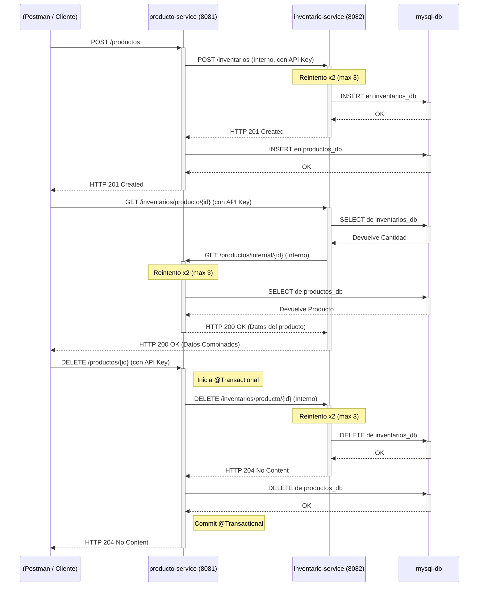

# Proyecto: Microservicios de Productos e Inventario

Esta es una solución de microservicios que simula la gestión de productos y su inventario correspondiente.

## 1. Descripción de la Arquitectura

La solución está compuesta por dos microservicios independientes y una base de datos, orquestados por Docker Compose:

* **`producto-service` (Puerto 8081):**
    * Gestiona el CRUD (Crear, Leer, Actualizar, Borrar) de los productos.
    * Contiene la lógica de negocio para la creación y eliminación, asegurando la consistencia transaccional llamando al servicio de inventario.

* **`inventario-service` (Puerto 8082):**
    * Gestiona las existencias (stock) de un producto.
    * Expone un endpoint para consultar el inventario combinado (Inventario + Detalles del Producto).
    * Recibe llamadas internas desde `producto-service` para crear o eliminar registros de inventario.

* **`mysql-db` (Puerto 3306):**
    * Una única instancia de MySQL 8 que aloja dos bases de datos (schemas) separadas: `productos_db` e `inventarios_db`. Esto garantiza el aislamiento de los datos de cada microservicio, aunque compartan el mismo motor de BD.

### Comunicación y Seguridad

* **Comunicación:** La comunicación entre servicios es **síncrona (HTTP/REST)** y se implementa usando clientes **OpenFeign** para un código más limpio.
* **Seguridad:** La comunicación interna (servicio a servicio) está protegida mediante un **API Key compartido** (`SERVICE_API_KEY`). Un `HandlerInterceptor` en cada servicio valida este *header* en los endpoints protegidos, devolviendo `401 Unauthorized` si falta o es incorrecto.

## 2. Diagrama de Interacción

A continuación, se muestran los flujos de comunicación síncrona para las operaciones clave:



## 3. Decisiones Técnicas y Justificaciones

* **Base de Datos (MySQL 8):** Se eligió una BD SQL para garantizar la **integridad referencial y las transacciones ACID**, críticas para una aplicación de inventario. Se usan *schemas* separados para mantener el aislamiento de datos.

* **Comunicación (Feign + Spring Retry):** Se optó por una comunicación HTTP síncrona para cumplir los requisitos. Se usó **OpenFeign** para simplificar el código del cliente. Para cumplir con los requisitos de robustez:
    * **Timeouts:** Se configuró un `RestTemplateBuilder` global con **timeouts de 5 segundos** (`setConnectTimeout` y `setReadTimeout`).
    * **Reintentos:** Se implementó **Spring Retry** (`@EnableRetry`) y se anotaron los métodos de Feign con `@Retryable(maxAttempts = 3)` para cumplir el requisito de "2 reintentos" (1 intento + 2 reintentos).

* **Seguridad (API Key Interceptor):** Se implementó un `HandlerInterceptor` de Spring para validar el *header* `SERVICE_API_KEY`. Esta es una estrategia simple y efectiva para la autenticación interna de servicio a servicio, protegiendo endpoints críticos (como `PUT`, `DELETE` o la creación interna de inventario).

* **Consistencia (Transacciones):** Para la operación de `DELETE /productos`, el método en `producto-service` está anotado con `@Transactional`. Si la llamada HTTP al `inventario-service` falla (incluso después de los reintentos), se lanza una excepción que provoca un **rollback**, impidiendo que el producto sea borrado si su inventario no pudo ser eliminado y manteniendo así la consistencia de los datos.

* **Containerización (Docker Compose):** Se utiliza `docker-compose.yml` con `healthcheck` y `depends_on: condition: service_healthy` en el servicio `mysql-db`. Esto asegura que los microservicios de Spring Boot no intenten iniciarse (y fallar) hasta que la base de datos esté completamente lista para aceptar conexiones.

* **Pruebas:** Se implementó una estrategia de pruebas robusta:
    * **Pruebas Unitarias (Mockito):** Se probó la lógica de negocio en la capa `Service` (ej. `testProcesarCompra_StockInsuficiente_LanzaExcepcion`).
    * **Pruebas de Integración (MockMvc):** Se probó la capa `Controller` para validar la seguridad, el manejo de errores y las respuestas HTTP (ej. `testEliminarProducto_SinApiKey_Retorna401Unauthorized` y `testObtenerProductoPorId_NoEncontrado_Retorna404NotFound`).

* **Desviación (JSON:API vs HATEOAS/HAL):**
    * **Requisito:** `Implementa JSON API (https://jsonapi.org/)`.
    * **Decisión:** Durante el desarrollo, la librería `com.toedter.spring-hateoas-jsonapi` presentó conflictos de dependencias persistentes que impedían la compilación.
    * **Pivote:** Para entregar una solución funcional se tomó la decisión de utilizar al estándar **HATEOAS (HAL)**, que está soportado nativamente por Spring Boot (`application/hal+json`). Esto cumple el *espíritu* del requisito (respuestas HATEOAS) aunque la paginación sea la estándar de Spring (`?page=0&size=5`) y no la de `page[number]`.

## 4. Instrucciones de Instalación y Ejecución

### Pre-requisitos
* Git
* Docker y Docker Compose (Docker Desktop)
* Java 17 (para desarrollo local)
* Maven (para desarrollo local)

### Ejecución (Modo Docker - Recomendado)

1.  **Clonar el repositorio:**
    ```bash
    git clone https://github.com/inZane-Dev/microservicios--producto--inventario.git
    cd [NOMBRE-DE-LA-CARPETA-RAIZ] 
    ```
    *(La carpeta raíz es la que contiene el archivo `docker-compose.yml`)*

2.  **Limpiar volúmenes (Opcional, solo si hay ejecuciones previas):**
    ```bash
    docker compose down -v
    ```

3.  **Construir e Iniciar todos los servicios:**
    Este comando compilará los `.jar`, ejecutará todas las pruebas (unitarias y de integración) y luego construirá las imágenes e iniciará los contenedores.
    ```bash
    docker compose up --build -d
    ```

La aplicación estará lista cuando los tres contenedores estén en estado `Up`.

### Endpoints Clave

* **Servicio de Productos:** `http://localhost:8081`
* **Documentación API (Productos):** `http://localhost:8081/swagger-ui.html`

* **Servicio de Inventario:** `http://localhost:8082`
* **Documentación API (Inventario):** `http://localhost:8082/swagger-ui.html`

* **Base de Datos (MySQL):** `localhost:3306`
    * **User:** `user`
    * **Password:** `password`